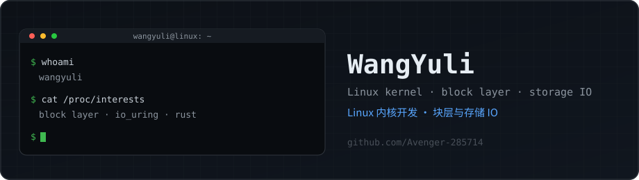
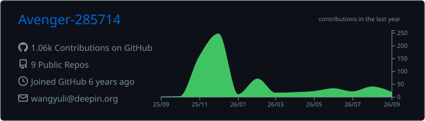
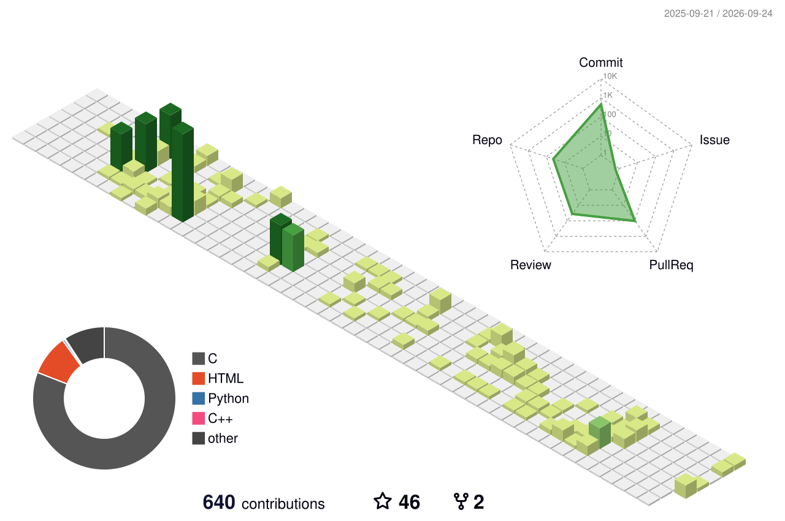

## About / 关于

I'm WangYuli, a system software developer in Beijing. Most of my work is on the Linux kernel, mainly the block layer and storage IO paths. I also build packages for deepin and write Rust tools on the side.

我是 WangYuli，在北京做系统软件。主要写 Linux 内核，集中在块层和存储 IO；平时也给 deepin 打包，业余写点 Rust。

## GitHub stats / 统计

## My programming activity / 编程活动

WakaTime tracks my coding time; the charts render live on every page load.

编码时长由 [WakaTime](https://wakatime.com) 统计，图表随页面加载实时刷新。

<!-- WAKATIME-PLACEHOLDER
     Replace this block once tracking data builds up.
     7-day coding activity:
       
     language breakdown:
       
     Get the URLs from the WakaTime dashboard: open a chart, click "Embed",
     copy the SVG link. -->

Charts will show up here after a few days of tracking.

接入统计后，图表几天内就会出现。

## Contribution graph / 贡献图

<picture>
  <source media="(prefers-color-scheme: dark)" srcset="https://raw.githubusercontent.com/Avenger-285714/Avenger-285714/output/github-snake-dark.svg">
  <source media="(prefers-color-scheme: light)" srcset="https://raw.githubusercontent.com/Avenger-285714/Avenger-285714/output/github-snake.svg">
  
</picture>

## Recent activity / 最近动态

<!--RECENT_ACTIVITY:start-->
1. ⬆️ Pushed undefined commit(s) to [Avenger-285714/DeepinKernel](https://github.com/Avenger-285714/DeepinKernel) 
2. ⬆️ Pushed undefined commit(s) to [Avenger-285714/DeepinKernel](https://github.com/Avenger-285714/DeepinKernel) 
3. 💪 Opened PR [#2166](undefined) in [deepin-community/kernel](https://github.com/deepin-community/kernel) 
4. ⬆️ Pushed undefined commit(s) to [Avenger-285714/kimi-code](https://github.com/Avenger-285714/kimi-code) 
5. ⬆️ Pushed undefined commit(s) to [Avenger-285714/DeepinKernel](https://github.com/Avenger-285714/DeepinKernel) 
6. ⬆️ Pushed undefined commit(s) to [Avenger-285714/DeepinKernel](https://github.com/Avenger-285714/DeepinKernel) 
7. ⬆️ Pushed undefined commit(s) to [Avenger-285714/DeepinKernel](https://github.com/Avenger-285714/DeepinKernel) 
8. ⬆️ Pushed undefined commit(s) to [Avenger-285714/DeepinKernel](https://github.com/Avenger-285714/DeepinKernel) 
<!--RECENT_ACTIVITY:end-->

## What I'm working on / 在做什么

- [wyl-linux-dev](https://github.com/Avenger-285714/wyl-linux-dev): my Linux kernel development tree
- [MailArrow](https://github.com/Avenger-285714/MailArrow): a mail client written in Rust
- [stardust](https://github.com/Avenger-285714/stardust): an experiment rebuilding spark-store in Rust
- I keep forks of [LTP](https://github.com/Avenger-285714/ltp), [blktests](https://github.com/Avenger-285714/blktests), [ublksrv](https://github.com/Avenger-285714/ublksrv) and [liburing](https://github.com/Avenger-285714/liburing) for block layer testing and userspace IO work.

- [wyl-linux-dev](https://github.com/Avenger-285714/wyl-linux-dev)：我的 Linux 内核开发树
- [MailArrow](https://github.com/Avenger-285714/MailArrow)：Rust 写的邮件客户端
- [stardust](https://github.com/Avenger-285714/stardust)：用 Rust 重写 spark-store 的实验
- 平时也维护 [LTP](https://github.com/Avenger-285714/ltp)、[blktests](https://github.com/Avenger-285714/blktests)、[ublksrv](https://github.com/Avenger-285714/ublksrv)、[liburing](https://github.com/Avenger-285714/liburing) 的 fork，做块层测试和用户态 IO。

## Find me / 联系

- Blog: <https://avenger-285714.github.io>
- GitHub: [@Avenger-285714](https://github.com/Avenger-285714)

- 博客：<https://avenger-285714.github.io>
- GitHub：[@Avenger-285714](https://github.com/Avenger-285714)
