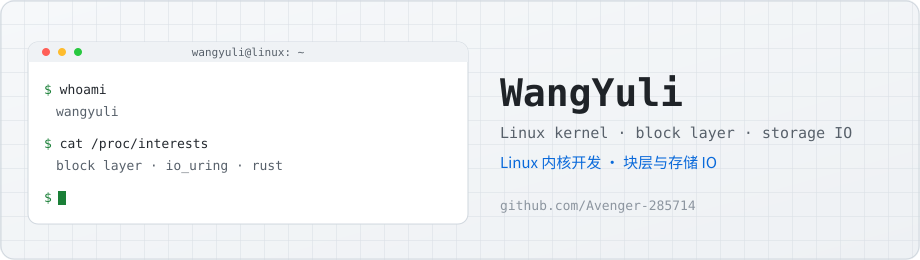
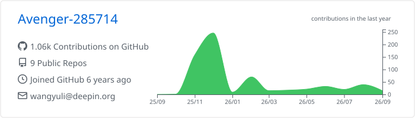
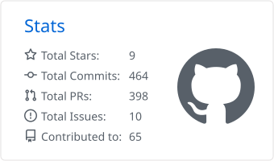
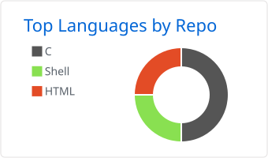
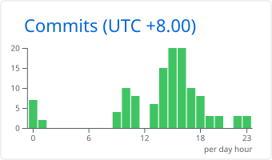
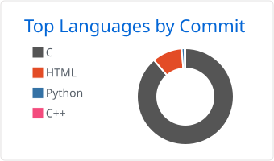

<picture>
  <source media="(prefers-color-scheme: dark)" srcset="assets/banner.svg">
  
</picture>

## About / 关于

I'm WangYuli, Linux Kernel developer.

我是 WangYuli，Linux 内核开发者。

## GitHub stats / 统计

<picture><source media="(prefers-color-scheme: dark)" srcset="profile-summary-card-output/github_dark/0-profile-details.svg"></picture><picture><source media="(prefers-color-scheme: dark)" srcset="profile-summary-card-output/github_dark/3-stats.svg"></picture>

<picture><source media="(prefers-color-scheme: dark)" srcset="profile-summary-card-output/github_dark/1-repos-per-language.svg"></picture><picture><source media="(prefers-color-scheme: dark)" srcset="profile-summary-card-output/github_dark/4-productive-time.svg"></picture>

<picture><source media="(prefers-color-scheme: dark)" srcset="profile-summary-card-output/github_dark/2-most-commit-language.svg"></picture>

<picture>
  <source media="(prefers-color-scheme: dark)" srcset="https://streak-stats.demolab.com?user=Avenger-285714&theme=github-dark-blue&hide_border=true">
  
</picture>

## My programming activity / 编程活动

WakaTime tracks my coding time; the charts render live on every page load.

编码时长由 [WakaTime](https://wakatime.com) 统计，图表随页面加载实时刷新。

<!-- WAKATIME-PLACEHOLDER
     Replace this block once tracking data builds up.
     7-day coding activity:
       
     language breakdown:
       
     Get the URLs from the WakaTime dashboard: open a chart, click "Embed",
     copy the SVG link. -->

Charts will show up here after a few days of tracking.

接入统计后，图表几天内就会出现。

## Contribution graph / 贡献图

<picture>
  <source media="(prefers-color-scheme: dark)" srcset="profile-3d-contrib/profile-night-green.svg">
  
</picture>

<picture>
  <source media="(prefers-color-scheme: dark)" srcset="https://raw.githubusercontent.com/Avenger-285714/Avenger-285714/output/github-snake-dark.svg">
  <source media="(prefers-color-scheme: light)" srcset="https://raw.githubusercontent.com/Avenger-285714/Avenger-285714/output/github-snake.svg">
  
</picture>

## Recent activity / 最近动态

<!--RECENT_ACTIVITY:start-->
1. 💪 Opened a PR in [deepin-community/kernel](https://github.com/deepin-community/kernel) 
<!--RECENT_ACTIVITY:end-->

## What I'm working on / 在做什么

- [wyl-linux-dev](https://github.com/Avenger-285714/wyl-linux-dev): my Linux kernel development tree / 我的 Linux 内核开发树
- [LTP](https://github.com/Avenger-285714/ltp) · [blktests](https://github.com/Avenger-285714/blktests) · [ublksrv](https://github.com/Avenger-285714/ublksrv) · [liburing](https://github.com/Avenger-285714/liburing): forks I keep for block layer testing and userspace IO / 我维护的 fork，用于块层测试和用户态 IO

## Find me / 联系

- Blog: [https://avenger-285714.github.io](https://avenger-285714.github.io)
- GitHub: [@Avenger-285714](https://github.com/Avenger-285714)
